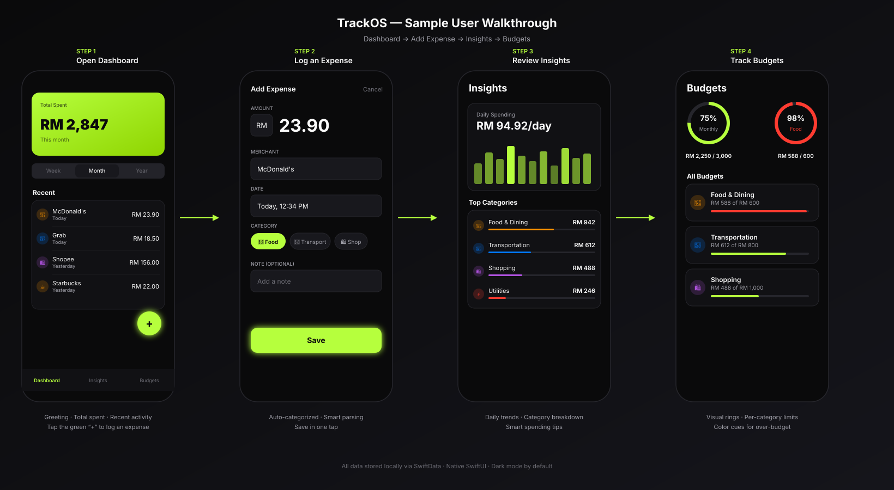
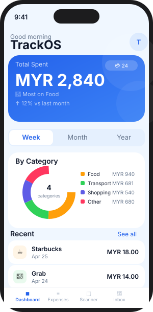
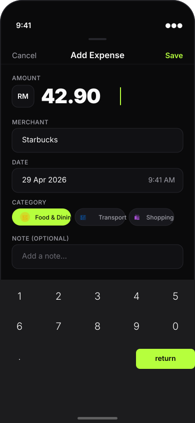
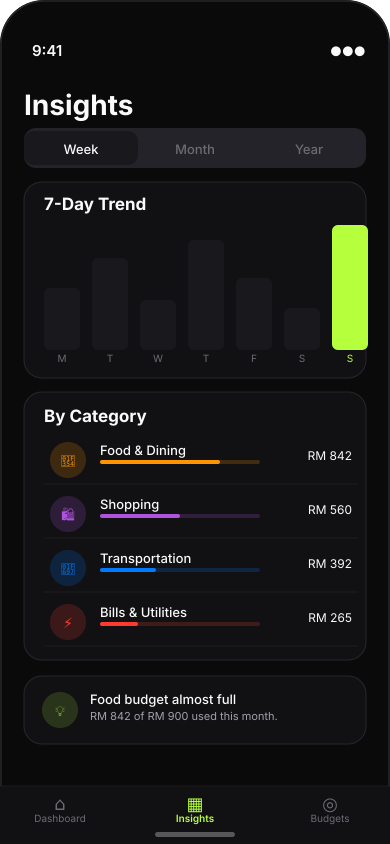
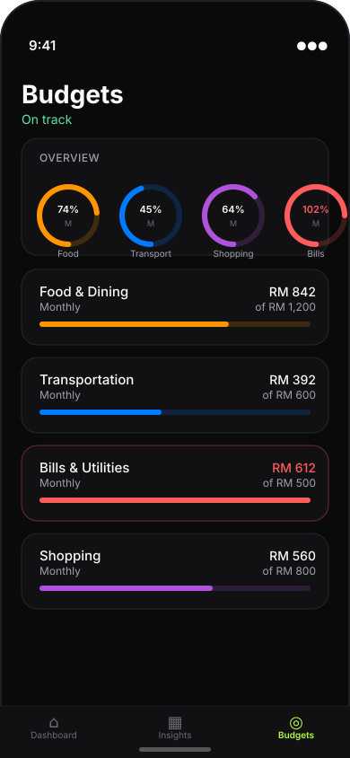

# TrackOS — User Guide

A walkthrough of the four core flows in the app: **Dashboard**, **Add Expense**, **Insights**, and **Budgets**.

---

## Sample Walkthrough

The animated storyboard below cycles through the full journey at a glance — from opening the dashboard to logging a new expense, reviewing insights, and tracking budgets.



> The SVG above includes subtle motion (pulsing FAB, save-button highlight, animated arrows) when rendered in a browser. For a true screen recording, run the app on a simulator and capture with **`xcrun simctl io booted recordVideo demo.mov`**, then drop it at `media/demo.mov` and reference it here.

---

## 1. Dashboard



**What you see:**
- A **greeting** based on the time of day.
- The **Total Spent** balance card for the selected period (Week / Month / Year).
- A **period picker** to scope all numbers below it.
- **Quick actions**: add an expense or scan a receipt.
- **Recent activity** — the last expenses across all categories.
- A floating **+** button (FAB) for fast entry from anywhere on the screen.

**Try it:**
1. Tap **Month** in the period picker — the balance card and recent list update.
2. Tap the green **+** at the bottom-right (or **+ Add Expense** in quick actions) to open the entry sheet.

---

## 2. Add Expense



**What you see:**
- **Amount** field with a currency picker (defaults to your home currency, e.g. RM).
- **Merchant** field — start typing and the app auto-classifies the category for you.
- **Date / time** picker, defaulting to now.
- **Category** chips — tap to override the auto-suggestion.
- Optional **note** field for context.
- A bright **Save** button that's only enabled when the form is valid.

**Try it:**
1. Type `23.90` in the amount field.
2. Type `McDonald's` for the merchant — the **Food & Dining** chip becomes selected automatically.
3. Tap **Save**. The sheet closes and the dashboard reloads with your new expense at the top.

> **Auto-classification** is powered by `KeywordCategoryClassifier`. It runs locally — no network calls — and you can always override the suggestion before saving.

---

## 3. Insights



**What you see:**
- **Daily Spending** chart — a 30-day bar chart showing your average and trend.
- **Top Categories** — your highest-spending categories with a horizontal bar showing share of spend.
- **Smart tips** that surface anomalies (e.g. *"Food & Dining is 18% above your usual"*).

**Try it:**
1. Swap the chart period (Week / Month / 3 Months / Year) at the top.
2. Tap any category row to drill into its expenses.
3. Pull-to-refresh to recompute insights against the latest data.

---

## 4. Budgets



**What you see:**
- **Overview rings** at the top — your monthly total and the most at-risk category.
- A list of **per-category budgets** with progress bars.
- Color cues: green when on-track, red when exceeded.

**Try it:**
1. Tap a budget row to edit its limit.
2. Add a new budget by tapping **+** and choosing a category + amount + period.
3. Watch the rings recolor as soon as you log expenses on the dashboard.

---

## Recording Your Own Demo Video

To capture a real screen recording (mp4) for this guide:

```bash
# 1. Boot a simulator
xcrun simctl boot "iPhone 16 Pro"

# 2. Build & install the app
xcodebuild -scheme AppShell -destination 'platform=iOS Simulator,name=iPhone 16 Pro' build

# 3. Start recording
xcrun simctl io booted recordVideo --codec h264 media/demo.mov

# (run through the four flows above, then press Ctrl+C to stop)
```

Then reference it in this file:

```markdown
https://user-images.githubusercontent.com/.../demo.mov
```

GitHub auto-renders `.mov` and `.mp4` uploaded via PR drag-and-drop into an inline player.
