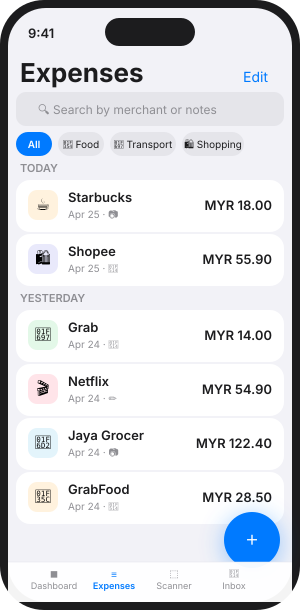
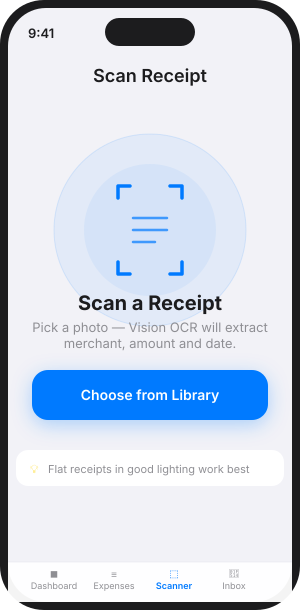
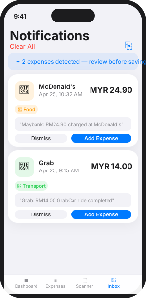

# TrackOS

An iOS expense tracker that captures spending automatically from financial notifications and receipt images.

## Screenshots

<table>
  <tr>
    <td align="center">
      
      <br/><sub><b>Dashboard</b></sub>
    </td>
    <td align="center">
      
      <br/><sub><b>Expense List</b></sub>
    </td>
    <td align="center">
      
      <br/><sub><b>Receipt Scanner</b></sub>
    </td>
    <td align="center">
      
      <br/><sub><b>Notification Review</b></sub>
    </td>
  </tr>
</table>

## Features

- **Notification Parsing** — financial push notifications are parsed for amount, merchant, and category. A manual paste flow and iOS Shortcuts URL scheme (`trackos://expense?text=…`) are also supported.
- **Receipt OCR** — pick any receipt photo and Vision framework extracts merchant, total, date, and line items for review before saving.
- **Smart Categorisation** — rule-based inference assigns categories (Food, Groceries, Transport, etc.) from merchant names and notification text.
- **Dashboard** — monthly spend summary with category breakdown and recent expenses.
- **Expense List** — searchable, filterable list with swipe-to-delete.

## Requirements

- iOS 17+
- Xcode 15+

## Project Setup

1. In Xcode: **File → New → Project → iOS App** (SwiftUI + SwiftData)
2. Set deployment target to **iOS 17.0**
3. Drag the contents of `Sources/TrackOS/` into the project navigator
4. Enable **Push Notifications** and **Background Modes → Background fetch** capabilities
5. Add to `Info.plist`:
   - `NSCameraUsageDescription`
   - `NSPhotoLibraryUsageDescription`
   - `CFBundleURLTypes` with scheme `trackos`

## Architecture

```
Sources/TrackOS/
├── App/                    @main entry, TabView shell
├── Models/                 Expense (SwiftData), ExpenseCategory, ExpenseSource, ParsedExpense
├── Services/
│   ├── NotificationParserService   regex-based financial text parser
│   ├── NotificationMonitorService  UNUserNotificationCenter delegate + pending queue
│   └── ReceiptOCRService           Vision OCR pipeline
└── Features/
    ├── Dashboard/          monthly summary + category chart
    ├── ExpenseList/        searchable list + detail view
    ├── AddExpense/         manual entry form
    ├── ReceiptScanner/     image picker → OCR → review
    └── NotificationReview/ pending parsed expenses from notifications
```

See [CLAUDE.md](CLAUDE.md) for deeper architectural notes.
